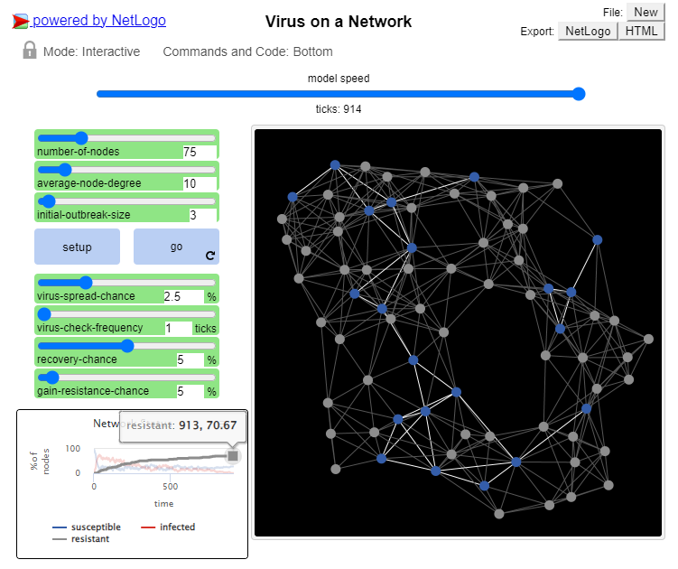
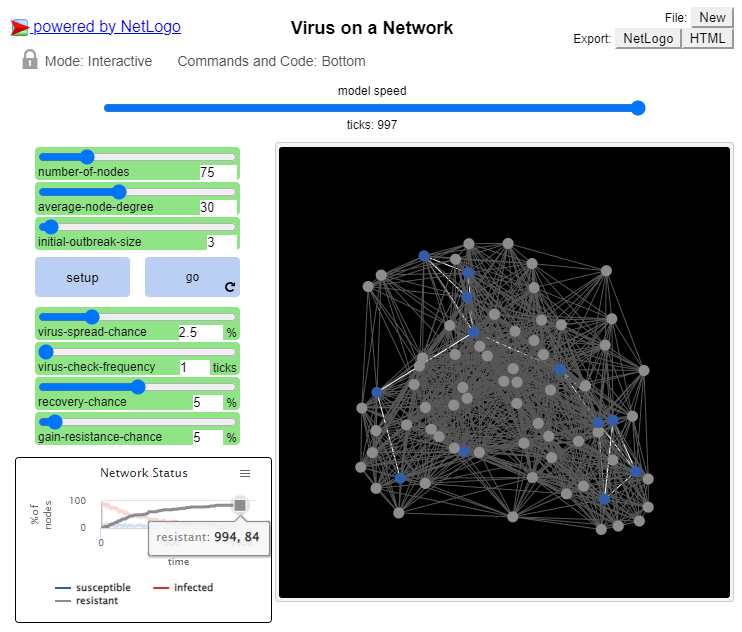
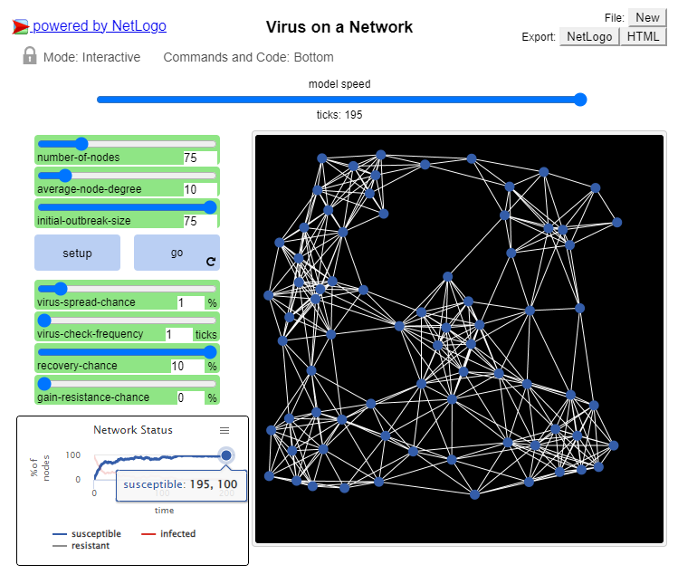
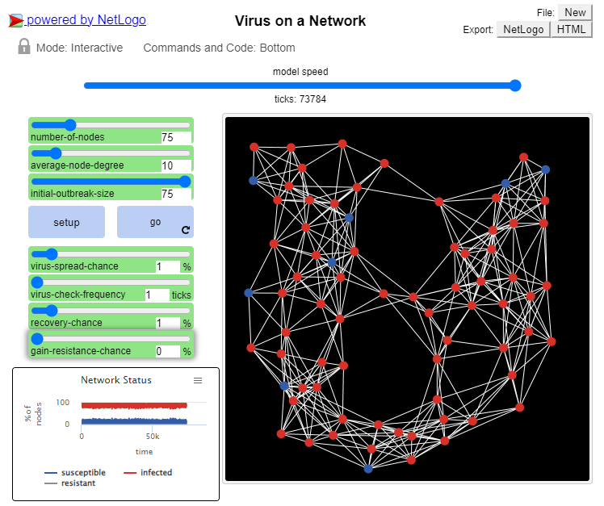
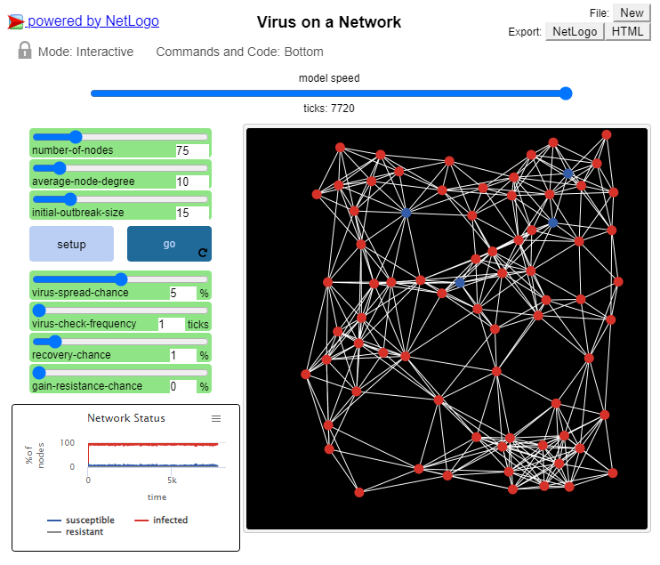

## Імітаційне моделювання комп'ютерних систем
## СПм-21-2, **Філіппов Владлен Валерійович**
### Лабораторна робота №**1**. Опис імітаційних моделей та проведення обчислювальних експериментів

### Вибрана модель у середовищі NetLogo:
[Virus on a Network](https://www.netlogoweb.org/launch#https://www.netlogoweb.org/assets/modelslib/Sample%20Models/Networks/Virus%20on%20a%20Network.nlogo)

 

### Вербальний опис моделі:
Ця модель демонструє поширення вірусу через мережу. Хоча модель є дещо абстрактною, одна з інтерпретацій полягає в тому, що кожен вузол представлено комп'ютером, і ми моделюємо просування комп'ютерного вірусу (або хробака) через цю мережу. Кожен вузол може перебувати в одному з трьох станів: сприйнятливий, інфікований або стійкий. В науковій літературі таку модель іноді називають SIR-моделлю для епідемій.

**SIR** розшифровується як "Сприйнятливий, Інфікований та Одужалий" (або, як альтернатива, "Вилікуваний") і вказує на три можливі стани членів популяції, уражених інфекційною хворобою.

### Керуючі параметри:
- **number-of-nodes** встановлює кількість вузлів мережі.
- **average-node-degree** визначає середню кількість зв'язків виходячих із кожного вузла.
- **initial-outbreak-size** встановлює кількість інфікованих вузлів на початку симуляції.
- **virus-spread-chance** повзунок що задає імовірність вдалого інфікування вузлу (у %-ному співвідношенні).
- **virus-check-frequency** повзунок що допомагає задати частоту перевірки вузла на інфікованість (по-дефолту вузел неспроможний ідентифікувати його інфіковано інстантно).
- **recovery-chance** імовірність одужання певного вузла (у %-ному співвідношенні) у разі якщо перед цим вузол було ідентифіковано як інфікований.
- **gain-resistance-chance** повзунок, що дозволяє встановити імовірність отримання стійкоісті (у %-ному співвідношенні) відносно вірусу, у випадку, якщо певний вузол був успішно вилікуваний.

### Внутрішні параметри:
- **infected?** якщо значення 'true', вузол є інфікованим.
- **resistant?** якщо значення 'true', вузол є стійкім до вірусу і не може бути інфікованим.
- **virus-check-timer** кількість тіков із моменту останньої первірки вузла на інфікованість вірусом.

### Критерії ефективності системи:
- кількість інфікованих вузлів.
- кількість вузлів, що були інфіковані, одужали і мають стійкість до вірусу.
- кількість звичайних (підозрілих) вузлів.

### Примітки:
В кінці циклу, після того, як вірус згас, деякі вузли все ще залишаються сприйнятливими, а інші стали імунними. Яке співвідношення кількості імунних вузлів до кількості сприйнятливих? Як на це впливає зміна AVERAGE-NODE-DEGREE мережі.

Із метою вирішення цього питання було проведелно два дослідження.

Незалежні від дослідження значення параметрів:
- **number-of-nodes** -> 75
- **initial-outbreak-size** -> 3
- **virus-spread-chance** -> 2.5 %
- **virus-check-frequency** -> 1 tick
- **recovery-chance** -> 5 %
- **gain-resistance-chance** -> 5%

Дослідження №1. **average-node-degree** -> 10

Дослідження №2. **average-node-degree** -> 30

Як можна побачити, в залежності від кількості предвстановлених зв'язків залежить %-ове співвідношення вузлів що отримали імунитет та тих що ні. Таким чином, результатом першого дослідження є 70.67% вузлів, які стали імунними, а результатом другого дослідження стало 84% вузлів. Підводячи підсумки, більше зв'язків на етапі початку симуляціїї, тобто більше імунованих вузлів як результат.

### Недоліки моделі:
Реальні комп'ютерні мережі, в яких поширюються віруси, як правило, не засновані на просторовій близькості, як мережі, знайдені в цій моделі. Реальні комп'ютерні мережі частіше демонструють "безмасштабний" розподіл ступенів зв'язку, дещо схожий на мережі, створені за допомогою моделі Preferential Attachment. Спробуйте поекспериментувати з різними альтернативними мережевими структурами і подивіться, як відрізняється поведінка вірусу.

### Обчислювальні експерименти

#### 1. Встановіть **gain-resistance-chance** у 0%. Завдяки яким налаштуванням вірус все ж таки буде поборено? Скільки часу це займає?

У моєму випадку, окрім встановленого **gain-resistance-chance** у 0%, я також встановив **recovery-chance** у 10%, **virus-spread-chance** у 1% та **initial-outbreak-size** у максимальну кількість вузлів, тобто 75.

Як результат було отримана досить швидка симуляція (195 тіків), після проведення якої усі вузли були здоровими і вірус було знищено.

#### 2. Які налаштування потрібні щоб вірус не було знешкдоджено? 

Потрібно встановити невелике значення для **recovery-chance** та **gain-resistance-chance** параметрів.

#### 3. Якщо **recovery-chance** більше ніж 0, а значення **virus-spread-chance** доволі високе, як ви гадаєте, чи може симуляція тривати нескінченно, а вірус залишатись живим? 

Згідно проведеного тестування, так, це можливо.

Як можна побачити на скриншоті вище, **recovery-chance** встановлено у 1%, **virus-spread-chance** у 5%, але **gain-resistance-chance** встановлено у 0%, що дає змогу вірусу поширюватись вузлами нескінченно, і навіть, якщо вузол одужав, він із легкістю може бути інфікований знов, оскільки імунітету в нього не буде.