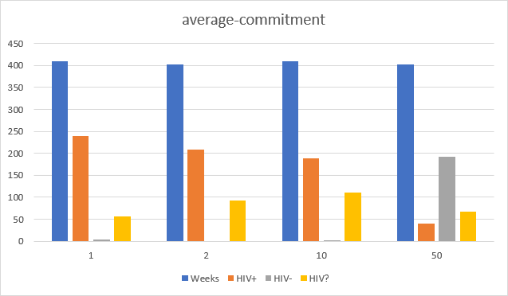

## Імітаційне моделювання комп'ютерних систем
## СПм-21-2, **Філіппов Владлен Валерійович**
### Лабораторна робота №**1**. Опис імітаційних моделей та проведення обчислювальних експериментів

### Вибрана модель у середовищі NetLogo:
[HIV](https://www.netlogoweb.org/launch#https://www.netlogoweb.org/assets/modelslib/Sample%20Models/Biology/HIV.nlogo)

 

### Вербальний опис моделі:
Ця модель імітує поширення вірусу імунодефіциту людини (ВІЛ) статевим шляхом через невелику ізольовану людську популяцію. Таким чином, вона ілюструє вплив певних сексуальних практик на популяцію.

Як відомо, ВІЛ поширюється різними шляхами, серед яких статевий контакт є лише одним із них. ВІЛ також може передаватися через спільне використання голок серед споживачів ін'єкційних наркотиків, через переливання крові (хоча це стало дуже рідкісним явищем у таких країнах, як Сполучені Штати, де кров перевіряється на наявність антитіл до ВІЛ), або від ВІЛ-інфікованих жінок до їхніх дітей до або під час пологів, або після них, через грудне вигодовування. Ця модель фокусується лише на поширенні ВІЛ-інфекції статевим шляхом.

Модель досліджує емерджентні ефекти чотирьох аспектів сексуальної поведінки. Користувач контролює схильність населення до утримання від статевих контактів, кількість часу, протягом якого середньостатистична "пара" в популяції перебуває разом, схильність населення до використання презервативів та схильність населення до тестування на ВІЛ. Вивчення першої та другої змінних може проілюструвати, як зміни в сексуальних звичаях у нашому суспільстві сприяли зростанню поширеності захворювань, що передаються статевим шляхом, тоді як вивчення третьої та четвертої змінних може запропонувати сучасні шляхи вирішення проблеми.

Дозволяючи користувачеві контролювати, як часто пересічна людина вирішить пройти тестування, користувач може дослідити важливий аспект загрози ВІЛ для громадського здоров'я. Оскільки вірус не відразу дає про себе знати в організмі носія, люди часто залишаються інфікованими протягом певного часу, перш ніж тест або симптоми імунодефіциту (що призводить до проведення тесту) ідентифікують їх як таких. Регулярне виявлення осіб, інфікованих вірусом, може мати значний вплив на громадське здоров'я, якщо знання про інфекцію позитивно вплине на сексуальну поведінку. Дана модель досліджує цю можливість, примушуючи всіх осіб, які знають про свій позитивний ВІЛ-статус, завжди практикувати безпечний секс. 

### Керуючі параметри:
- **initial-people** встановлює кількість людей під час симуляції.
- **average-coupling-tendency** визначає імовірність того, що член населення має статеві стосунки.
- **average-commitment** встановлює скількі у середньому тривають сексульні стосунки у пар.
- **average-condom-use** встановлює загальна ймовірність того, що населення користується презервативом.
- **average-test-frequency** визначає сернеднє значення того, як часто люди перевіряються на ВІЛ шляхом здачі аналізу крові.

### Внутрішні параметри:
- **infection-chance** 1 шанс із 100, що інфікована людина передасть інфекцію далі.
- **symptoms-show** зазначає як довго людина буде інфікована, перш ніж з'являться симптоми.
- **slider-check-1**, **slider-check-2**, **slider-check-3**, **slider-check-4** набір параметрів, що визначає тимчасові змінні для значень повзунків, щоб при зміні повзунків на льоту модель помічала і відповідно змінювала тенденції людей.
- **infected?** якщо значення параметра у 'true', то людина інфікована. Це може бути відомо або невідомо.
- **known?** якщо значення параметра у 'true', то інфекція відома (і infected? також має бути true).
- **infection-length** визначає як довго особа була інфікована.
- **coupled?** якщо значення параметра у 'true', то особа перебуває в сексуально активній парі.
- **couple-length** визначає як довго особа перебуває в парі.
- **commitment** визначає як довго людина буде залишатися в парі-відносинах.
- **coupling-tendency** визначає наскільки ймовірно, що людина приєднається до пари.
- **condom-use** визначає відсоток ймовірності того, що людина буде використовувати презерватив.
- **test-frequency** частота тестувань - кількість разів, яку людина буде проходити тестування на рік.
- **partner** визначає людину, яка є нашим поточним партнером у парі.

### Критерії ефективності системи:
- кількість людей із наявним ВІЛ у організмі.
- кількість людей із відсутностю ВІЛ у організмі.
- загальна кількість людей у експерименті.

### Примітки:
Проведіть ряд експериментів за допомогою кнопки GO, щоб з'ясувати вплив різних змінних на поширення ВІЛ-інфекції. Спробуй використати у своєму експерименті хороший контроль. Хороший контроль - це коли між дослідами змінюється лише одна змінна. Наприклад, щоб з'ясувати, який вплив має середня тривалість стосунків, проведіть чотири експерименти з повзунком СЕРЕДНЯ ТРИВАЛІСТЬ ЗВ'ЯЗКІВ, встановленим на 1 в перший раз, на 2 в другий раз, на 10 в третій раз і на 50 в останній раз. Наскільки збільшився рівень поширеності ВІЛ у кожному випадку? Чи відповідає це Вашим очікуванням?

### Недоліки моделі:
Як і всі комп'ютерні симуляції людської поведінки, ця модель з необхідністю суттєво спростила свою предметну область. Тому модель надає численні можливості для розширення:

Модель зображує сексуальну активність у вигляді двох людей, які стоять поруч один з одним. Це припускає, що всі пари мають статеві стосунки, а утримання практикується лише в самотності. Модель може бути змінена, щоб відобразити більш реалістичне уявлення про те, що таке пари. Люди можуть бути в парі, не займаючись сексом. Тоді, щоб показати секс, потрібно було б використати нове графічне зображення. Можливо, секс можна було б символізувати тим, що плями під парою на короткий час спалахували б іншим кольором.

### Обчислювальні експерименти

#### 1. Проведіть ряд експериментів за допомогою кнопки GO, щоб з'ясувати вплив різних змінних на поширення ВІЛ-інфекції. Спробуй використати у своєму експерименті хороший контроль. Хороший контроль - це коли між дослідами змінюється лише одна змінна. Наприклад, щоб з'ясувати, який вплив має середня тривалість стосунків, проведіть чотири експерименти з повзунком СЕРЕДНЯ ТРИВАЛІСТЬ ЗВ'ЯЗКІВ, встановленим на 1 в перший раз, на 2 в другий раз, на 10 в третій раз і на 50 в останній раз. Наскільки збільшився рівень поширеності ВІЛ у кожному випадку? Чи відповідає це Вашим очікуванням?

Результат експерименту зображено на зображенні нижче.

Добігаючи висновку згідно проведеного експерименту можна зазначити, що чим довше ВІЛ-інфіковані знаходяться у одних і тих самих відносинах, тим рідше вони інфікують інших здорових людей і, як результат, загальний %-ок інфікованого суспільства збільшується не так швидко (яскраві приклади можна побачити порівнявши результати першої і останньої симуляції).