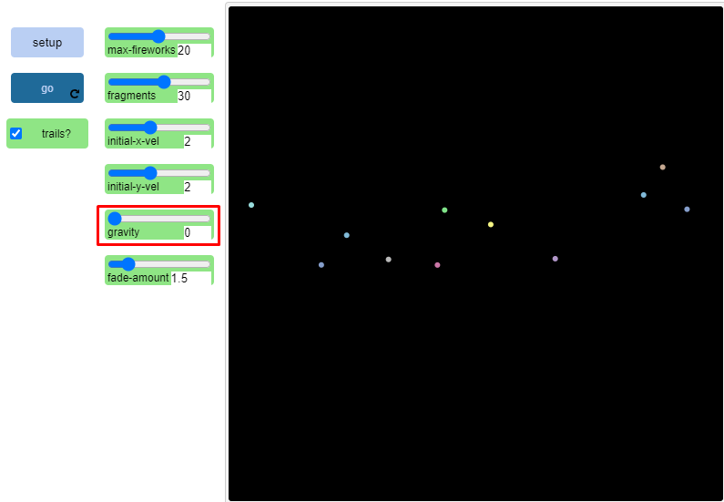
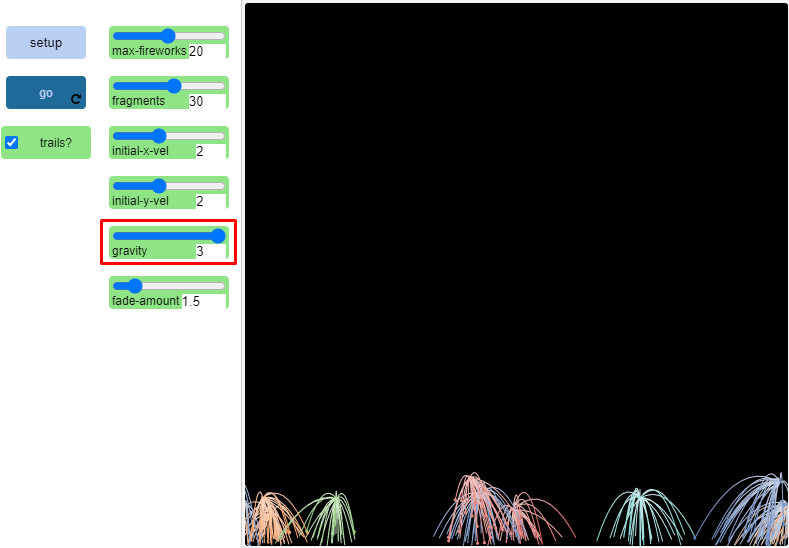

## Імітаційне моделювання комп'ютерних систем
## СПм-21-2, **Філіппов Владлен Валерійович**
### Лабораторна робота №**1**. Опис імітаційних моделей та проведення обчислювальних експериментів

### Вибрана модель у середовищі NetLogo:
[Fireworks](http://www.netlogoweb.org/launch#http://www.netlogoweb.org/assets/modelslib/Sample%20Models/Art/Fireworks.nlogo)

 

### Вербальний опис моделі:
Симуляція феєкверків. На 2-вимірній площіні з долу до гори запускаються "кульки", які, після проходження н-ної відстані до гори,"вибухають" та утворють навколо себе ще певну кількість "кульок", що, як результат, нагадує реальні іскри після вибуху частини заряду феєрверку у небі.
Після цього "іскри" або залишки феєрверку "падають" у низ та зникають, після чого процесс повторюється безліч разів, змінюючи лише кількість запущєних феєрверків та їх базову траекторію запуску. 

### Керуючі параметри:
- **max-fireworks** встановлює максимальну кількість запущених ракет під час одного запуску феєрверку.
- **fragments** визначає, скільки осколків з'явиться після вибуху одного феєрверку.
- **initial-x-vel** встановлює початкову швидкість х кожної ракети на випадкове число між від'ємним та додатним значенням числа, вказаного на повзунку.
- **initial-y-vel** встановлює початкову швидкість по осі Y кожної ракети на випадкове число між 0 і числом, вказаним на повзунку, плюс десять. Це робиться для того, щоб гарантувати, що існує діапазон різниці в початкових швидкостях у феєрверків.
- **gravity** визначає гравітаційну силу в навколишньому середовищі. Більше значення дасть більше гравітаційне прискорення, а це означає, що частинки будуть притискатися до землі з більшою швидкістю. Для менших значень справедливо зворотне.
- **fade-amount** визначає швидкість, з якою частинки вибуху затухають після вибуху.
- **trails?** дозволяє користувачеві вмикати або вимикати сліди, залишені частинками вибуху. Іншими словами, якщо перемикач TRAILS включений, то іскри будуть залишати сліди. Якщо він вимкнений, то вони не будуть залишати слідів.

### Внутрішні параметри:
- **col**. задає колір частинки вибуху.
- **terminal-y-vel**. швидкість, з якою вибухне ракета.
- **dim**. використовується для декларування затухання частинок під час їх падіння.

### Критерії ефективності системи:
- швидкість проходження одного циклу феєрверку.
- кількість випущених ракет феєрверку.

### Примітки:
Поекспериментуйте з повзунками INIT-X-VEL та INIT-Y-VEL. Зверніть увагу, що при початковій швидкості х, яка дорівнює нулю, ракети стартують прямо вгору. При збільшенні початкової швидкості х зверніть увагу на те, що деякі ракети описують в небі дугу вліво або вправо в залежності від того, чи є початкова швидкість х від'ємною або додатною.

З початковою швидкістю у зверніть увагу на те, що при фіксованому значенні сили тяжіння висота феєрверку менша при менших початкових швидкостях у і більша при більших. Також зверніть увагу, що кожна ракета вибухає на висоті, яка дорівнює або трохи менша за її вершину.

### Недоліки моделі:
Після вибуху ракети іскри деякий час рухаються до землі, але проходячи відносно малу відстань зупиняються так і не впавши на землю.

 

## Обчислювальні експерименти

### 1. Що відбувається з моделлю, коли повзунок GRAVITY встановлюється в різні значення. Що відбувається з моделлю, коли GRAVITY встановлюється на нуль.

У даній ситуації, коли сила гравітації встановлена на позначці 0, ракети не реагують зовсім на "закон тяжіння" і швидкість з якою вона, або її "іскри" після вибуху будуть прагнути до землі теж еквівалентна 0. Саме тому на екрані неможливо побачити вибух феєрверку, який, ймовірніше за все, відбувається за межами екрану.

### 2. Чи можете ви пояснити, що відбувається з феєрверками в моделі? Чи можете ви пояснити, чому відбувається це явище?
Кожен феєрверк, або його ракета, представлена окремою "точкою", запускається вгору з початковою швидкістю x та y. У певній точці неба відбувається вибух, який створює певну кількість "іскор" феэрверку. Кожна створена іскра, успадковує швидкість від початкової ракети на додаток до швидкості від самого вибуху. В результаті виходить імітація феєрверку.

### 3. Тепер встановіть повзунок GRAVITY на найбільше значення. Що змінилося в поведінці феєрверку при такому налаштуванні? Який висновок ви можете зробити про зв'язок між силою тяжіння і тим, як предмети рухаються в просторі?

Встановлюємо максимальне значення для сили гравітації (на даний момент це значення 3).

Як результат такого моделювання, феєрверк не встигає дуже високо взлетіти та вибухає через долі секунд після старту, а його "іскри", за рахунок максимального значення сили тяжіння, встигають впасти до землі та малюють довший "трасер" ніж було при звичайних вибухах.