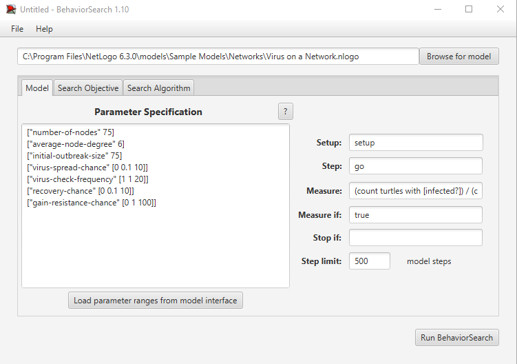
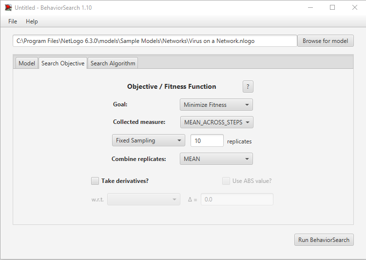
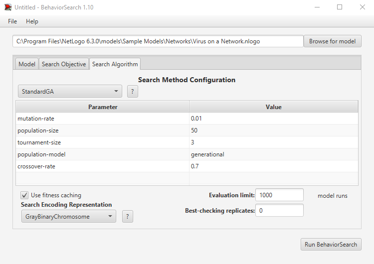
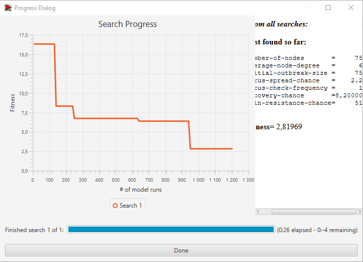
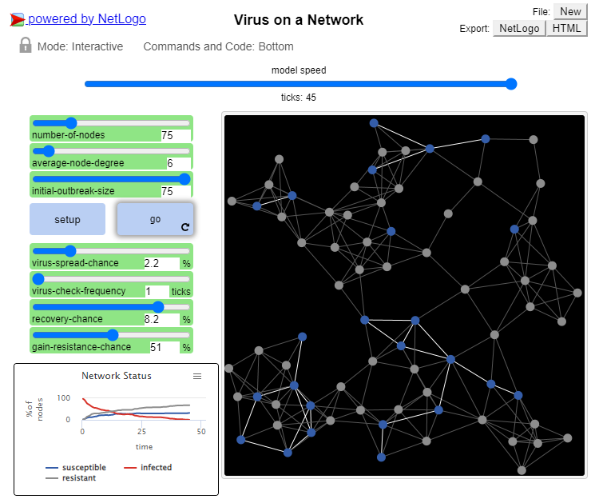
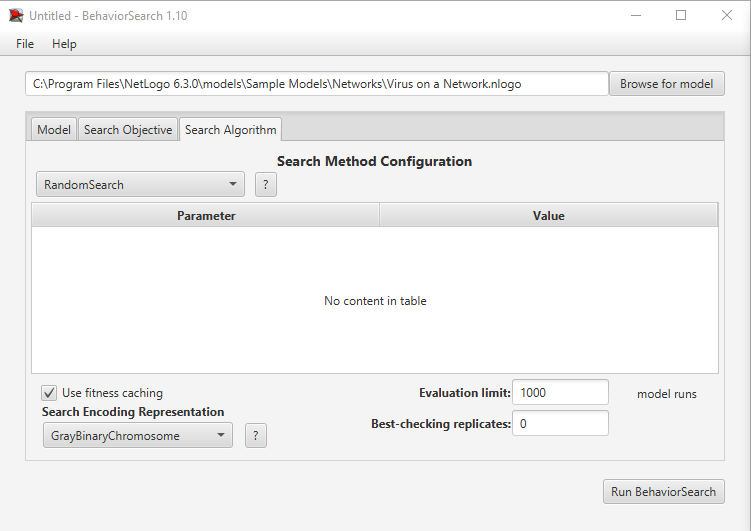
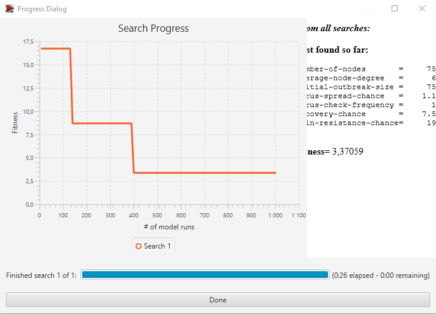
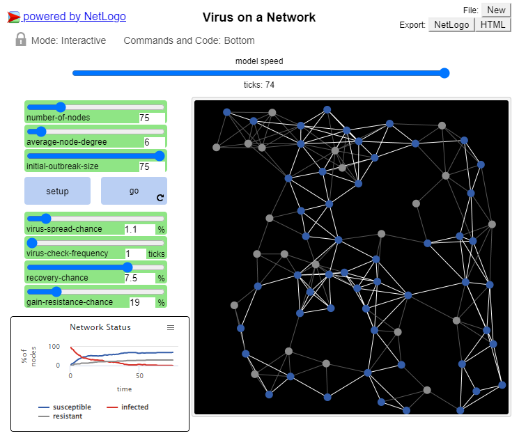

## Імітаційне моделювання комп'ютерних систем
## СПм-21-2, **Філіппов Владлен Валерійович**
### Лабораторна робота №**3**. Використання засобів обчислювального інтелекту для оптимізації імітаційних моделей.

 

### Обрана модель у середовищі NetLogo:
[Virus on a Network](https://www.netlogoweb.org/launch#https://www.netlogoweb.org/assets/modelslib/Sample%20Models/Networks/Virus%20on%20a%20Network.nlogo)

### Опис імітаційної моделі
Згідно умови до виковання лабораторної роботи опис імітаційної моделі було запозичено із одній з минулих лабораторних робіт (якщо точніше, то із лабораторної роботи №1). Опис можна знайти за наступним [посиланням](https://github.com/Malvarix/CSSM/blob/master/LW1-ADD1/report.md).

### Робота із BehaviorSearch

За ідею було покладено пошук найкоротшого шляху задля зниження кількості інфікованих вузлів до 0 (до речі, у такому випадку симуляція повністю завершується при звичайному виконанні).

Тож перейдемо до налаштування BehaviorSearch.

#### Налаштування BS №1. Таб 'Model'.

**По-перше**, було обрано шлях розташування моделі:

<pre>
C:\Program Files\NetLogo 6.3.0\models\Sample Models\Networks\Virus on a Network.nlogo
</pre>

**По-друге**, імпортовані параметри із інтерфейсу моделі та доналаштовані (3 із яких було обрано незмінними, задля перевірки роботи алгоритмів):

- ["number-of-nodes" 75]
- ["average-node-degree" 6]
- ["initial-outbreak-size" 1]
- ["virus-spread-chance" [0 0.1 10]]
- ["virus-check-frequency" [1 1 20]]
- ["recovery-chance" [0 0.1 10]]
- ["gain-resistance-chance" [0 1 100]]

**По-третє**, значення для фітнес-функції було обрано шляхом отримання кількості неінфікованих вузлів за допомогою наступного виразу <pre>(count turtles with [infected?]) / (count turtles) * 100</pre> та занесено у 'Measure' поле. 

**Четверте**, значення для 'Measure if' було встановлено у 'true', за для впровадження охвату по всім тактам симуляції.

#### Налаштування BS №2. Таб 'Search Objective'.

**По-перше**, за ціль ('Goal') було обрано 'Minimize fitness', оскільки ми бажаємо мінімізувати кількість інфікованих вузлів (бажано до 0) як найшвидше.

**По-друге**, значення для 'Collected measure' обране як 'MEAN_ACROSS_STEPS', що значить буде взяте середнє  значення із усіх мінімальних отриманих за весь період симуляції.

**По-третє**, із метою передбачення некоректних результатів, при тестуванні симуляційної моделі, кожна симуляція повторюється 10 разів та, як результат, береться середнє арифметичне значення усіх реплікаційних симуляцій. *Задаэться за допомогою 'Combine replicates' та значення 'MEAN'.

#### Налаштування BS №3. Таб 'Search algorithm'. Використання 'StandardGA'.

**По-перше**, як алгоритм було обрано генетичний алгоритм або 'StandardGA'.

**По-друге**, кількість ітерацій пошуку було встановлено у 1000.

Всі інші параметри/налаштування на даній вкладці були встновлені по-дефолту і не були змінені.

#### Результати використання 'StandardGA'.

Верифікування отриманих даних на реальній моделі:

#### Налаштування BS №4. Таб 'Search algorithm'. Використання 'RandomSearch'.

**По-перше**, як алгоритм було обрано алгоритм рандому або 'RandomSearch'.

**По-друге**, кількість ітерацій пошуку було встановлено у 1000.

Всі інші параметри/налаштування на даній вкладці були встновлені по-дефолту і не були змінені.

#### Результати використання 'RandomSearch'.

Верифікування отриманих даних на реальній моделі:

### Висновок

Добігаючи висновку, можна помітити, що у моєму випадку параметри запропоновані на основі результатів генетичного алгоритму ('StandardGA') відпрацьовують швидше, тобто імітація завершується швидше (за меншу кількість тактів) оскільки кількість інфікованих вузлів різко зменшується.